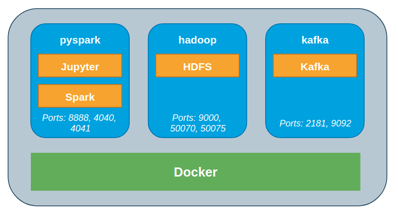

# Spark-and-Hadoop-Developer

Application that ingest console messages ussing Kafka into a spark dataframe.



For starting the application, simply run:
```
docker-compose up
```

For accesing the HDFS container:
``` 
docker exec -it hadoop bash
```
For entering the Kafka container and starting the ingesting there's a small bash script;
``` 
./terminal-kafka-prod.sh
```
For stoping the application:
``` 
docker-compose down
```